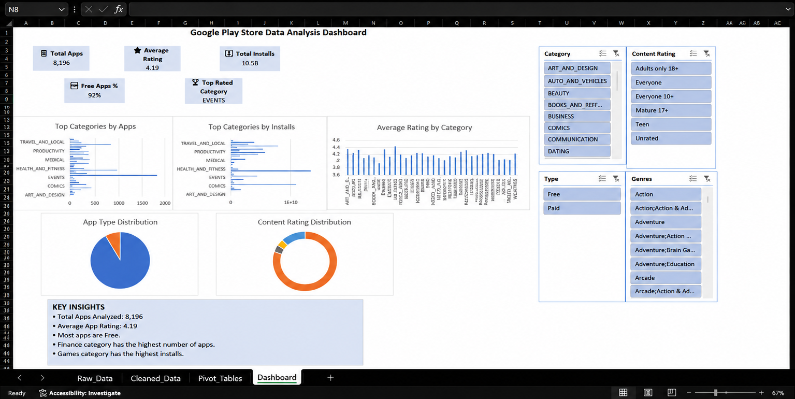
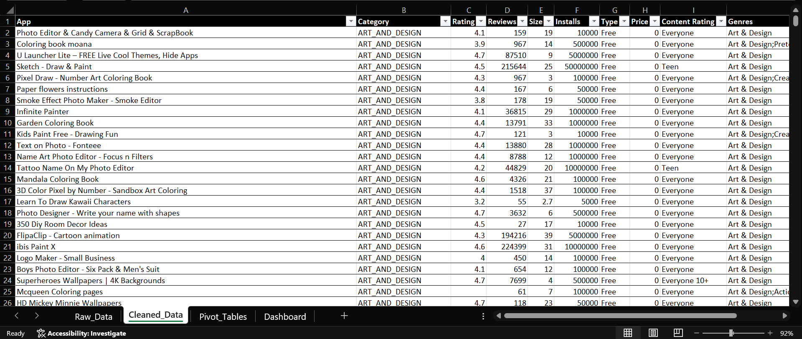

# 📊 Google Play Store Data Analysis Dashboard

## 📌 Project Overview

This project focuses on analyzing Google Play Store application data using Microsoft Excel. The dataset was cleaned, transformed, and visualized to uncover meaningful insights about app categories, ratings, installs, content ratings, and app types.

An interactive dashboard was created using Pivot Tables, Pivot Charts, KPI Cards, and Slicers to enable dynamic data exploration and business insights.

---

## 🎯 Objectives

* Clean and prepare Google Play Store data.
* Analyze app distribution across categories.
* Evaluate ratings, installs, and app popularity.
* Compare Free vs Paid applications.
* Build an interactive Excel dashboard for decision-making.

---

## 🛠️ Tools Used

* Microsoft Excel
* Data Cleaning
* Pivot Tables
* Pivot Charts
* Slicers
* Dashboard Design

---

## 📂 Dataset Information

The dataset contains information about Google Play Store applications, including:

* App Name
* Category
* Rating
* Reviews
* Installs
* Type
* Content Rating
* Genres

---

## 📈 Dashboard Features

### KPI Cards

* Total Apps: 8,196
* Average Rating: 4.19
* Total Installs: 10.5B
* Free Apps Percentage: 92%
* Top Rated Category: Events

### Visualizations

* Top Categories by Apps
* Top Categories by Installs
* Average Rating by Category
* App Type Distribution
* Content Rating Distribution

### Interactive Filters

* Category
* Content Rating
* Type
* Genres

---

## 🔍 Key Insights

* More than 90% of applications on the Play Store are free.
* The Events category has the highest average rating.
* App installs vary significantly across categories.
* Finance and Game-related categories dominate app popularity.
* Interactive filtering allows detailed category-level analysis.

---

## 📸 Dashboard Preview

### Dashboard Overview



### Cleaned Dataset



---

## 📁 Repository Structure

```text
Google_Play_Store_Analysis_Dashboard
│
├── Google Play Store Data Analysis Dashboard.xlsx
├── Dashboard.png
├── Cleaned_Data.png
└── README.md
```

---

## 🚀 Skills Demonstrated

* Data Cleaning
* Data Transformation
* Exploratory Data Analysis (EDA)
* Dashboard Development
* Data Visualization
* Business Insight Generation

---

## 👩‍💻 Author

**Kapa Sri Lakshmi**

B.Tech – Computer Science and Engineering
Mohan Babu University
Aspiring Data Analyst

GitHub: https://github.com/kapasrilakshmi075
